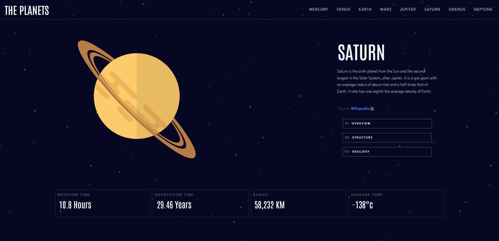

# Planet Facts

A crypto industry app built with React, Redux and Ant Design.
<br />
[Live Preview](https://nickmagidson.github.io/planet-facts/)

## Description

The Solar System Facts Explorer is a visually appealing and interactive React project that provides users with fascinating information about the planets in our solar system. Built using React, Sass, Bootstrap components, and MDB-Ui, this project offers a seamless and engaging experience for users who are eager to explore the wonders of our cosmic neighborhood.

## Getting Started

### Dependencies

* react / react-dom
* react-router-dom
* react-bootstrap
* bootstrap
* mdb-react-ui-kit
* mdb-ui-kit
* sass
* gh-pages
* vite
* @fortawesome


### Executing program
```
cd planet-facts
npm install
```

```
npm start
```